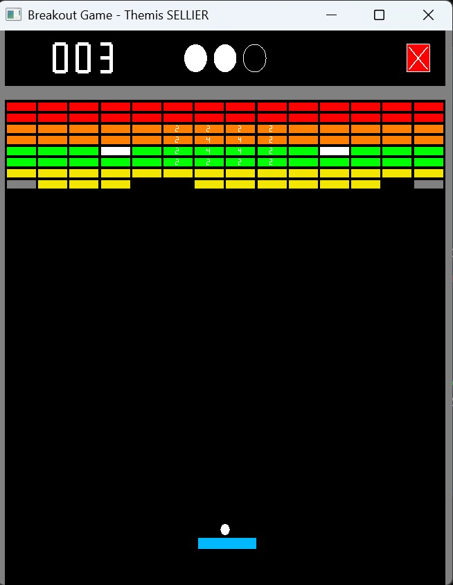

# 🎮 Breakout Game — Themis SELLIER

A **Breakout-style game** written in **C** using **OpenGL (GLFW)**.  
The player controls a paddle to bounce a ball and break all the bricks on screen while collecting bonuses and avoiding maluses.

## 🧱 Features

- Complete gameplay with **bricks, paddle, and ball physics**
- **Bonuses and maluses** that affect speed, paddle size, and lives  
- **Multiple screens** and increasing difficulty  
- **Three game states**:
  - Welcome screen  
  - Gameplay  
  - Game Over screen  
- Playable with:
  - **Arrow keys** ← → to move the paddle  
  - **Mouse** (click and drag or scroll) to control movement  
  - **Spacebar** to launch the ball  

## 🕹️ Controls

| Action | Keyboard | Mouse |
|--------|-----------|--------|
| Move paddle left | ← | Move cursor left |
| Move paddle right | → | Move cursor right |
| Launch ball | Spacebar | Left click |
| Small paddle move | Scroll wheel | — |

---

## 🧩 Gameplay Mechanics

- **Break all bricks** to clear the screen and advance to the next level.  
- **Special bricks** (gray, white) behave differently:
  - Gray = indestructible walls  
  - White = reflective bricks  
- **Bonuses / Maluses**:
  - 🟠 Extra life  
  - 🔴 Lose a life  
  - 🟡 Longer paddle  
  - 🟢 Shorter paddle  
  - 🟣 Faster ball  
  - 🔵 Slower ball  
  - ⚪ Ball trajectory modifiers  

## 📸 Screenshots
	

#
Here you can find more of my projects : https://github.com/themissellier/My-projects
